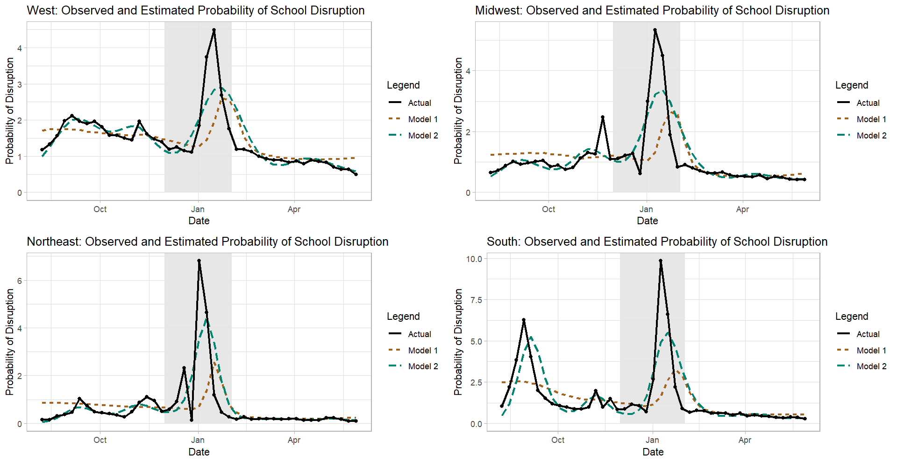

```{r setup, include=FALSE}
knitr::opts_chunk$set(echo = TRUE)
knitr::opts_chunk$set(tidy.opts=list(width.cutoff=60),tidy=TRUE)
```

\newpage
\setlength\parindent{40pt}
# Data Collection Protocol
\vspace{-3truemm}
For my analysis, I fit different specifications of a logistic regression model to understand the effect of public health trends on the estimated probability of disruptions to in-person learning during the 2021-2022 school year. The data was collected to help the Centers for Disease Control and Prevention (CDC), the Department of Education, and the White House assess how schools were operating during the COVID-19 pandemic (Parks et al, 2021). For the purpose of this assessment, CDC used the following definitions for school learning modalities (CDC, 2022):
\vspace{-3truemm}

* **In-Person**: "All schools within the district offer face-to-face instruction 5 days per week to all students at all available grade levels"
* **Remote**: "Schools within the district do not offer face-to-face instruction; all learning is conducted online/remotely to all students at all available grade levels"
* **Hybrid**: "Schools within the district offer a combination of in-person and remote learning; face-to-face instruction is offered less than 5 days per week, or only to a subset of students"

\vspace{-2truemm}
For my analysis, I combined "remote" and "hybrid" into a single category, where $1$ denotes "not operating fully in person" and $0$ denotes "operating fully in person". The dataset contains information about approximately $14500$ K-12 public and independent charter school districts in the U.S. This is a longitudinal dataset covering the school years between August 2021 and December 2022. It contains weekly estimates of how each school district was operating (e.g., fully in person, fully remotely, or in a hybrid setting). In addition to learning modality estimates, the dataset contains information about the number of schools within each school district and the total number of students throughout the district. Some school districts contain a single school, whereas other districts contain multiple schools.

Based on the National Center for Educational Statistics metadata file for the previous school year (NCES, 2021), throughout the country, there are more than $17000$ school districts that meet this definition. Clearly, the school districts included in the learning modalities dataset constitute just a subset of all U.S. public and independent charter school districts. This subset was a carefully selected mixture of rural and urban districts in order to strike a balance between a representative sample and a sample of large districts that accounts for as many students as possible (Burbio, 2022). Since the data collection period started, third-party contractors working for HHS have been reaching out to school districts each week and administering surveys to identify their learning modalities (Parks et al, 2021). A Hidden Markov Model (HMM) was used to integrate the different sources of information and estimate the most likely learning modality whenever there is conflicting information in the data sources (Parks et al, 2021). In other words, the learning modality estimates in this dataset are the output of a probabilistic model, so they may not be $100\%$ accurate, but they do an adequate job of describing school district operations during the pandemic. 

For the purposes of this paper, the output of the HMM is the input to my analysis. In addition to the learning modality dataset, I also imported state-level pediatric vaccination data (from CDC, 2021), COVID case data (from CDC, 2020), and 2021 population estimates (from Census Bureau, 2021). I also performed data transformations to create additional variables and did some preprocessing to make sure that the different input datasets are comparable (e.g., time series have weekly frequency, rates are per capita, etc). I then merged the different datasets using the *date* and *state* variables. Most districts (approximately $81\%$ of the sample) reported data for $100\%$ of the weeks in the 2021-2022 school year, but some districts had data missing for up to $97.73\%$ of the school year. Missingness could be happening at random, but there might also be a systematic reason for the missing data. For example, districts that are not operating fully in person may be less likely to respond, in which case there would be under-reporting of "remote" and "hybrid" learning modalities. The figure below shows that most districts were reporting for the entire school year, but whenever a district stops reporting, it does not report data for consecutive weeks. For this analysis, I only considered the $12015$ districts that had no missing data, but further research should address how to deal with the missingness.

\vspace{-5truemm}
{width=500px}

\vspace{-4truemm}
The vaccination, case/death, population estimate, and school learning modality datasets all come from observational studies, since there is no random assignment of treatments. As a result, we should be cautious about claiming any causal relationships between the variables in the dataset. Also there may be unperceived characteristics in different Census regions that may affect the probability of a district not operating fully in person (e.g., attitude toward public health and COVID restrictions, differences in local education laws, etc). The models I fit attempt to remedy this issue by accounting for the Census region a district is located in, but there may be other important explanatory variables that are missing from the models. One potential confounder is vaccine hesitancy among adults. If adults are refusing to get vaccinated, they probably avoid getting their children vaccinated too. If schools mandate vaccination for teachers and staff, those who refuse to get vaccinated may not be permitted to work, which could result in school disruptions. If this is the case, a decrease in pediatric vaccinations is associated with school disruptions but is not causing school disruptions. Another possible confounder is poor ventilation and air flow. Poor air flow could result in more COVID cases, but could also prompt district administrators to close schools for non-COVID reasons. Finally, not incorporating the missing data in the analysis could create problems with making inferences from the data if the reason the data is missing is associated with school disruptions. 
\vspace{-1truemm}

# The Statistical Analysis 
\vspace{-3truemm}
I fit a logistic regression model with different intercepts and slopes by region that takes into consideration the average student count within each district, as well as the number of new vaccinations per 100k and new COVID cases per 100k during the previous week.
\vspace{-4truemm}
$$\mathcal{M}_1: \text{logit} (\mathbf p_{t}) = \beta_0 + \beta_1 \mathbf X_{1} + \beta_2 \mathbf X_{2} + \beta_3 \mathbf X_{3} + \beta_4 \mathbf X_{4} + \beta_5 \mathbf X_{t - 1, 5} + \beta_6 \mathbf X_{t - 1, 6} + \sum_{j = 7}^{15} \beta_j \mathbf Z_j + \boldsymbol \varepsilon_t$$
where $\mathbf X_{1}, \mathbf X_{2}, \mathbf X_{3}$ are indicators for three of the census regions, $\mathbf X_{4}$ is the ratio of students to schools, and $\mathbf X_{t - 1, 5}, \mathbf X_{t - 1, 6}$ are the values of the lag-*1* (i.e., the previous week's) public health metrics. The $\mathbf Z_j$ are the $3 \cdot 3 = 9$ interaction terms between the three Census indicators and the three continuous variables.

Using a Likelihood Ratio Test, I compared the full version of the model to a reduced version of the model without indicators for the different Census regions. This tests the null hypothesis of having the same intercept and slopes regardless of region. With a p-value of $p < 0.0001$, there is strong enough evidence to reject the null hypothesis. At least one of the Census regions has an intercept and/or predictor effect that is significantly different from that of the other Census regions. The full model has an AIC of $75003.71$. All of the parameters except for $\beta_1$ (the difference in coefficients for the Midwest and the Northeast) and $\beta_{11}$ (the difference in the effect of *lag_cases_per_100k* in the Midwest and the South) have p-values much smaller than $0.05$. Table 1 contains the estimated parameters for the four Census regions. Although there are noticeable regional differences in the magnitude of the estimated parameters, the signs remain the same from region to region. For a one-unit increase in average student count within a district (while holding all other variables in the model constant), the log odds of a school disruption increase by between $0.000047$ and $0.000683$ depending on the Census region. Similarly, depending on the Census region, a one-unit increase in the previous week's COVID cases per 100k results in an increase of between $0.000539$ and $0.001395$ in the log odds. Finally, a one-unit increase in the previous week's pediatric COVID vaccinations per 100k results in a log-odds decrease of between $0.000052$ and $0.000142$. These changes in log odds do not necessarily indicate that there is a causal effect.

\begin{table}[H]\begin{center}
\caption{{\bf Results of Model 1}}\label{t:model1}
\begin{tabular}{l|cccc}
\hline
Region & Intercept & Students per School & Cases per 100k & Pediatric Vaccinations per 100k  \\ \hline
Midwest & -4.206805 & 0.000428 & 0.000998 & -0.000084 \\
Northeast & -4.262379 & 0.000683 & 0.001395 & -0.000136 \\
South & -3.553687 & 0.000679 & 0.000927 & -0.000142 \\
West & -3.819821 & 0.000047 & 0.000539 & -0.000052 \\
\hline
\end{tabular} 
\end{center}
\end{table}
\vspace{-1truemm}

I also fit a logistic regression spline model with different intercepts and curvatures by region.
\vspace{-3truemm}
$$\mathcal M_2: \text{logit} (\mathbf p_{t}) = \beta_0 + \beta_1 \mathbf X_{1} + \beta_2 \mathbf X_{2} + \beta_3 \mathbf X_{3} + \mathbf f(t, \mathbf X_{1}, \mathbf X_{2}, \mathbf X_{3}) + \boldsymbol \varepsilon_t$$
where $\mathbf f(t, \mathbf X_{1}, \mathbf X_{2}, \mathbf X_{3})$ is a linear combination of natural cubic spline basis functions for the *time* variable with $10$ degrees of freedom. I chose $df = 10$ because there are $10$ months in the dataset and because the observed proportion of districts not operating fully in person is very non-linear. Like before, $\mathbf X_{1}, \mathbf X_{2}, \mathbf X_{3}$ are indicators for the Northeast, South, and West Census regions.

Using a Likelihood Ratio Test, I compared the full version of the model to a reduced version of the model without indicators for the different Census regions. This tests the null hypothesis of having the same intercept and slopes regardless of region. With a p-value of $p < 0.0001$, there is strong enough evidence to reject the null hypothesis. At least one of the Census regions has an intercept and/or predictor effect that is significantly different from that of the other Census regions. The full model has an AIC of $75416.5$. Some of the parameters have p-values less than $0.05$, but they do not have a very intuitive or meaningful interpretation other than for making predictions.

I also assessed how well the two models fit by estimating the weekly probability of not operating fully in person for the average district within each Census region. For each Census region, I compared the estimated probabilities with the actual weekly proportions of districts not operating fully in person. Although $\mathcal M_1$ has a lower AIC, the following figure shows that, at least for a district with average values for all the continuous predictors, the curves from $\mathcal M_2$ more closely approximate the actual proportion of school disruptions. However, even $\mathcal M_2$ does not fully capture the rapid increase in the proportion of school disruptions during the January Omicron surge.

{width=520px}


\newpage

# Appendix
## References

* Burbio (2022). *Burbio's  School Opening Tracker Methodology*. Retrieved from https://about.burbio.com/school-opening-tracker-methodology on December 2, 2022
* Centers for Disease Control and Prevention (2020). *United States COVID-19 Cases and Deaths by State over Time - ARCHIVED* (data.cdc.gov version) [data file]. Centers for Disease Control and Prevention [distributor]. 
Retrieved from https://data.cdc.gov/Case-Surveillance/United-States-COVID-19-Cases-and-Deaths-by-State-o/9mfq-cb36 on December 2, 2022
* ———— (2021). *COVID-19 Vaccinations in the United States,Jurisdiction* (data.cdc.gov version) [data file]. Centers for Disease Control and Prevention [distributor]. 
Retrieved from https://data.cdc.gov/Vaccinations/COVID-19-Vaccinations-in-the-United-States-Jurisdi/unsk-b7fc on December 2, 2022
* ———— (2022). *School Learning Modalities* (HealthData.gov version) [data file]. United States Department of Health and Human Services [distributor]. Retrieved from https://healthdata.gov/National/School-Learning-Modalities/aitj-yx37 on December 2, 2022
* National Center for Educational Statistics (2021). *2020-2021 Local Education Agency (School District) Universe Survey Data, v.1a—Provisional* (nces.ed.gov edition) [data file]. National Center for Educational Statistics [distributor]. 
Retrieved from https://nces.ed.gov/programs/edge/Geographic/SchoolLocations on December 2, 2022
* Parks SE, Zviedrite N, Budzyn SE, et al. (2021). "COVID-19–Related School Closures and Learning Modality Changes — United States, August 1–September 17, 2021," *MMWR Morb Mortal Wkly Rep* [online]. 70:1374–1376. DOI: http://dx.doi.org/10.15585/mmwr.mm7039e2
* United States Census Bureau, (2021). *Annual Population Estimates, Estimated Components of Resident Population Change, and Rates of the Components of Resident Population Change for the United States, States, District of Columbia, and Puerto Rico: April 1, 2020 to July 1, 2021* (NST-EST2021-ALLDATA) [data file]. United States Census Bureau [publisher].
Retrieved from https://www.census.gov/data/tables/time-series/demo/popest/2020s-state-total.html#par_textimage on December 2, 2022

\newpage

## Sample Data
For the complete dataset, please see the CSV file called *combined_data.csv*

\begin{table}[H]\begin{center}
\caption{{\bf Sample Data}}\label{t:data}
\begin{tabular}{c|ccccccc}
\hline
ID & week & learning modality & state & vaccines per 100k & cases per 100k & students per school & region \\ \hline
0100005 & 2022-05-29 & 0 & AL & 8392 & 70.7 & 971 & South \\ 
0100006 & 2022-05-29 & 0 & AL & 8392 & 70.7 & 384 & South \\
0100007 & 2022-05-29 & 0 & AL & 8392 & 70.7 & 781 & South \\
0100008 & 2022-05-29 & 0 & AL & 8392 & 70.7 & 1063 & South \\
0100011 & 2022-05-29 & 0 & AL & 8392 & 70.7 & 519 & South \\
$\vdots$ & $\vdots$ & $\vdots$ & $\vdots$ & $\vdots$ & $\vdots$ & $\vdots$ & $\vdots$ \\
5605160 & 2021-08-01 & 0 & WY & NA & NA & 260 & West \\  
5605302 & 2021-08-01 & 0 & WY & NA & NA & 322 & West \\
5605690 & 2021-08-01 & 0 & WY & NA & NA & 137 & West \\  
5605695 & 2021-08-01 & 0 & WY & NA & NA & 358 & West \\  
5605762 & 2021-08-01 & 0 & WY & NA & NA & 254 & West \\  
5605830 & 2021-08-01 & 0 & WY & NA & NA & 287 & West \\
\hline
\end{tabular} 
\end{center}
\end{table}

\newpage

## R Code
``` {r code, warning = FALSE, message = FALSE}
# Import libraries
library(tidyverse)
library(lubridate)
library(splines)
library(gridExtra)

# Loading the data
source('data_integration.R')

# Missingness analysis
pivot <- df %>%
  select(district_nces_id, week, learning_modality) %>%
  pivot_wider(id_cols = district_nces_id, 
              names_from = week, values_from = learning_modality) %>%
  pivot_longer(!district_nces_id, names_to = 'week', values_to = 'is_missing') %>%
  mutate(is_missing = if_else(is.na(is_missing), 1, 0),
         week = as.Date(week))

# Plot of missing data for each district by week
ggplot(pivot) + 
  geom_tile(aes(x = week, y = district_nces_id, fill = as.factor(is_missing))) +
  scale_fill_manual(values = c('beige','darkred'), labels = c('No', 'Yes')) +
  theme(
    axis.ticks.y = element_blank(), # Remove y axis ticks
    axis.text.y = element_blank(),  # Remove y axis labels
    legend.background = element_rect(color = 'black',
                                     size = 1.1),
    legend.position = c(0.85, 0.85)
  ) +
  labs(x = 'Week', y = 'District', 
       title = 'Visualization of Missingness by District and Week',
       fill = 'Data Missing?') +
  scale_x_date(date_labels = "%b", date_breaks = "month", name = "Month")

# Distribution of data missingness
missingness <- pivot %>%
  group_by(district_nces_id) %>%
  summarise(pct_missing = 100 * mean(is_missing))
ggplot(missingness) +
  geom_histogram(aes(x = pct_missing),
                 color = 'black',
                 fill = 'darkred',
                 alpha = 0.7,
                 bins = 10) +
  labs(x = '% of Data Missing', y = 'Number of Districts', 
       title = 'Distribution of Data Missingness') +
  theme_light()
quantile(missingness$pct_missing, c(0.81, 0.82))

# Districts with no missing data
complete_districts <- missingness[missingness$pct_missing == 0, ]$district_nces_id

# Only keep districts with no missing data
df_original <- df
df <- df_original %>%
  filter(district_nces_id %in% complete_districts)

# Aggregating/averaging the data by region
regional <- df %>%
  drop_na() %>%
  group_by(region, week) %>%
  summarise(pct_disrupted = 100 * mean(learning_modality),
            lag_total_vaccines_per_100k = mean(lag_total_vaccines_per_100k),
            students_per_school = mean(students_per_school),
            lag_cases_per_100k = mean(lag_cases_per_100k),
            lag_deaths_per_100k = mean(lag_deaths_per_100k)) %>% 
  mutate(time = as.numeric(as.Date(week) - min(as.Date(week))))

# Graphing the regional learning modality data
ggplot(regional) + 
  geom_rect(aes(xmin = as.POSIXct("2021-12-01"), xmax = as.POSIXct("2022-02-01"), 
                ymin = 0, ymax = Inf), fill = "grey90", 
            alpha = 0.2, col = "grey90", inherit.aes = FALSE) +
  geom_line(aes(x = week, y = pct_disrupted, color = region), size = 1) + 
  geom_point(aes(x = week, y = pct_disrupted, color = region, shape = region), size = 1.5) +
  scale_color_manual(values = c('darkgoldenrod3', 'steelblue', 'darkred', 'aquamarine3')) +
  labs(x = 'Date', y = '% of Districts in Hybrid or Remote', 
       title = '% of Districts in Hybrid or Remote over Time') +
  theme_light()

# Epi curves
ggplot(regional) + 
  geom_rect(aes(xmin = as.POSIXct("2021-12-01"), xmax = as.POSIXct("2022-02-01"), 
                ymin = 0, ymax = Inf), fill = "grey90", 
            alpha = 0.2, col = "grey90", inherit.aes = FALSE) +
  geom_line(aes(x = week, y = lag_cases_per_100k, color = region), size = 1) + 
  geom_point(aes(x = week, y = lag_cases_per_100k, color = region, shape = region), size = 1.5) +
  scale_color_manual(values = c('darkgoldenrod3', 'steelblue', 'darkred', 'aquamarine3')) +
  labs(x = 'Date', y = 'Cases per 100K', 
       title = 'Previous Week Average Cases per 100K by Region') +
  theme_light()

# Model 1
model1_full <- glm(learning_modality ~ region + students_per_school + 
                     lag_cases_per_100k + lag_total_vaccines_per_100k + 
                     region:students_per_school + region:lag_cases_per_100k + 
                     region:lag_total_vaccines_per_100k, 
                   data = df, family = binomial())
model1_reduced <- glm(learning_modality ~ lag_cases_per_100k +  
                        students_per_school + lag_total_vaccines_per_100k, 
                      data = df, family = binomial())
anova(model1_reduced, model1_full, test = 'LRT')
model1 <- model1_full
summary(model1)

# Model 2
model2_full <- glm(learning_modality ~ region + ns(time, df = 10) + region:ns(time, df = 10), 
              data = df, family = binomial())
model2_reduced <- glm(learning_modality ~ ns(time, df = 10), 
                   data = df, family = binomial())
anova(model2_reduced, model2_full, test = 'LRT')
model2 <- model2_full
summary(model2)

# Model predictions
model1_vars <- c('region','students_per_school', 'lag_total_vaccines_per_100k', 
                 'lag_cases_per_100k')
regional$model1_probs <- 100*predict.glm(model1, 
                                         regional[, model1_vars], 
                                         type = 'response')
regional$model2_probs <- 100*predict.glm(model2, 
                                         regional[, c('region', 'time')], 
                                         type = 'response')

chart_west <- model_viz('West')
chart_midwest <- model_viz('Midwest')
chart_northeast <- model_viz('Northeast')
chart_south <- model_viz('South')

grid.arrange(chart_west, chart_midwest, chart_northeast, chart_south, nrow = 2)
```
