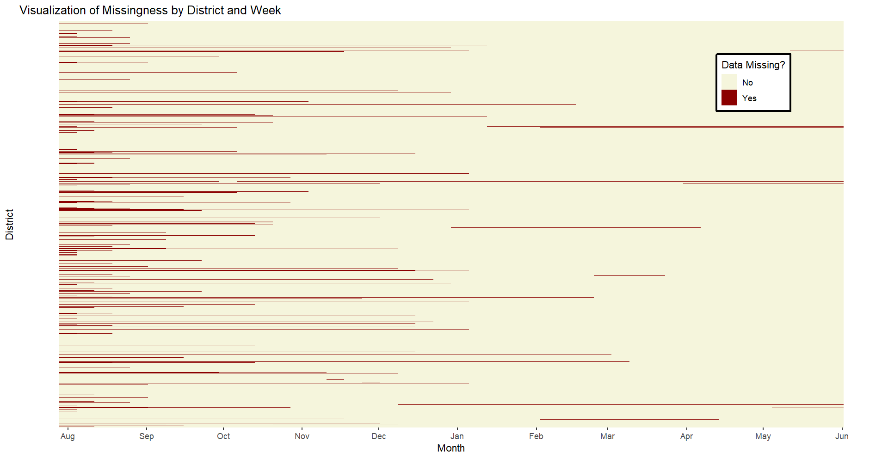
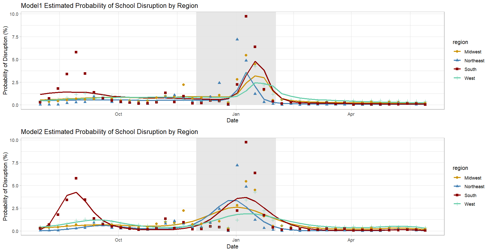

```{r setup, include=FALSE}
knitr::opts_chunk$set(echo = TRUE)
knitr::opts_chunk$set(tidy.opts=list(width.cutoff=60),tidy=TRUE)
```

\newpage

# Data Collection Protocol

For my analysis, I fit different specifications of a logistic regression model to understand the effect of public health trends and time on the estimated probability of disruptions to in-person learning during the 2021-2022 school year. The data was collected to help the Department of Health and Human Services, the Department of Education, and the White House assess how schools were operating during the COVID-19 pandemic (___, ). For the purpose of this assessment, we used the following definitions for school learning modalities:

* In-Person:
* Remote:
* Hybrid:

For my analysis, I combined "remote" and "hybrid" into a single category, where $1$ denotes "not operating fully in person" and $0$ denotes "operating fully in person". The dataset contains information about approximately $14,500$ K-12 public and independent charter school districts in the U.S. This is a longitudinal dataset covering the school years between August 2021 and December 2022. It contains weekly estimates of how each school district was operating (e.g., fully in person, fully remotely, or in a hybrid setting). In addition to learning modality estimates, the dataset contains information about the number of schools within each school district and the total number of students throughout the district. Some school districts contain a single school, whereas other districts contain multiple schools.

Based on the National Center for Educational Statistics (NCES, 20xx), throughout the country, there are more than $17,000$ school districts that meet this definition. Clearly, the school districts included in the learning modalities dataset constitute just a subset of all U.S. public and independent charter school districts. This subset was carefully selected by choosing a mixture of rural and urban districts in order to strike a balance between a representative sample and a sample of large districts that accounts for as many students as possible. Since the data collection period started, Burbio and MCH, a couple of third-party contractors working for HHS, have been reaching out to school districts each week and asking them a set of questions to identify their learning modalities.

There are some districts that only one third-party contractor covers, but there are also some districts that both contractors cover. A Hidden Markov Model (HMM) was used to integrate the different sources of information and estimate the most likely learning modality whenever there is conflicting information in the data sources (, 202x). In other words, the learning modality estimates in this dataset are the output of a probabilistic model, so they may not be $100\%$ accurate, but they do an adequate job of describing school district operations during the pandemic. For the purposes of this paper, the output of the HMM is the input to my analysis.

In addition to the learning modality dataset, I also imported state-level vaccination data from (), case and death data from (), and population estimate data from ___. I used Application Programming Interfaces to efficiently retrieve the data needed for this analysis. I did some preprocessing to m
The school learning modality data comes from an observational study, since there is no random assignment of treatments.

Potential confounders: ventilation and air flow, physical size of school building (i.e., are students able to sit far enough apart), 

# The Statistical Analysis




Missingness may be happening at random, or there might be a systematic reason for the missing data. For example, districts that are not operating fully in person may be less likely to respond, in which case there would be underreporting of "remote" and "hybrid" learning modalities.

Unperceived characteristics in different Census regions (e.g., political ideology, attitude toward public health and COVID restrictions, differences in local education laws, etc).

\begin{table}[H]\begin{center}
\caption{{\bf Results of Model 1}}\label{t:model1}
\begin{tabular}{l|c}
\hline
ID & Estimate \\ \hline
\hline
\end{tabular} 
\end{center}
\end{table}



# Conclusion


\newpage

# Appendix
## R Code
``` {r yada, warning = FALSE, message = FALSE}

```

## References

* https://data.cdc.gov/Case-Surveillance/United-States-COVID-19-Cases-and-Deaths-by-State-o/9mfq-cb36
* https://www.ncbi.nlm.nih.gov/pmc/articles/PMC4241048/
* https://www.ncbi.nlm.nih.gov/pmc/articles/PMC3016756/
* https://www.census.gov/data/tables/time-series/demo/popest/2020s-state-total.html#par_textimage
* https://data.cdc.gov/Vaccinations/COVID-19-Vaccinations-in-the-United-States-Jurisdi/unsk-b7fc
* https://healthdata.gov/National/School-Learning-Modalities/aitj-yx37

## Data
\begin{table}[H]\begin{center}
\caption{{\bf Sample Data}}\label{t:data}
\begin{tabular}{l|ccccccccc}
\hline
ID & week & learning modality & state & vaccines per 100k & time & cases per 100k & deaths per 100k & students per school & region \\ \hline
\hline
\end{tabular} 
\end{center}
\end{table}