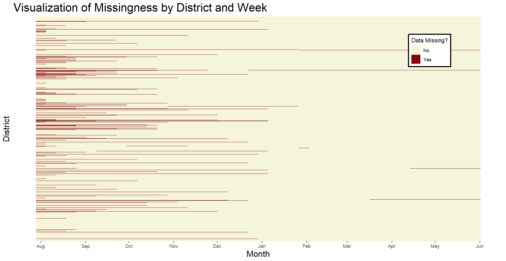
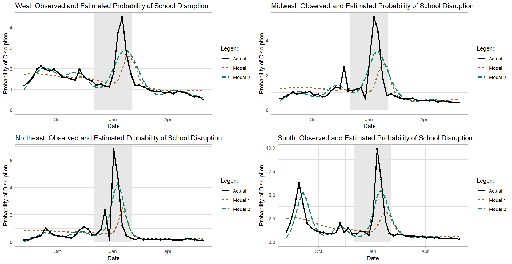

```{r setup, include=FALSE}
knitr::opts_chunk$set(echo = FALSE)
```

### Background
- Data collected to help HHS/CDC, DoEd, and the White House assess how schools were operating during the COVID-19 pandemic (Parks et al, 2021)
- Longitudinal dataset of approximately $14500$ K-12 public and independent charter school districts in the U.S.
- District-level weekly data of how U.S. school districts are operating for that week:
  - Fully in person, fully remote, or hybrid
- I combined "remote" and "hybrid" into a single category
  - $1$ denotes "not operating fully in person" and $0$ denotes "operating fully in person"
- Dataset contains information about the number of schools within each school district and the total number of students throughout the district
  
### Data Collection Protocol
- For the previous school year, throughout the country, there are more than $17000$ public and independent charter districts (NCES, 2021)
- Districts included in learning modalities dataset are just a subset of all U.S. public and independent charter school districts
  - Mixture of rural and urban districts
- Reaching out to school districts each week and administering surveys to identify their learning modalities (Parks et al, 2021) 
- Hidden Markov Model (HMM) used to integrate different sources of information and estimate most likely learning modality whenever there is conflicting information (Parks et al, 2021)

### Additional Data Sources
- Output of the HMM is the input to my analysis
- I also imported state-level pediatric vaccination data (from CDC, 2021), COVID case data (from CDC, 2020), and 2021 population estimates (from Census Bureau, 2021). 
  - Performed data transformations to create additional variables
  - Did some preprocessing to make sure that the different input datasets are comparable
     - e.g., time series have weekly frequency, rates are per capita, etc
- Merged the different datasets using the *date* and *state* variables

### Sample Data
\begin{table}[H]\begin{center} \fontsize{5pt}{7.2}\selectfont
\caption{{\bf Sample Data}}\label{t:data}
\begin{tabular}{c|ccccccc}
\hline
ID & week & modality & state & vaccines per 100k & cases per 100k & students per school & region \\ \hline
0100005 & 2022-05-29 & 0 & AL & 8392 & 70.7 & 971 & South \\ 
0100006 & 2022-05-29 & 0 & AL & 8392 & 70.7 & 384 & South \\
0100007 & 2022-05-29 & 0 & AL & 8392 & 70.7 & 781 & South \\
0100008 & 2022-05-29 & 0 & AL & 8392 & 70.7 & 1063 & South \\
0100011 & 2022-05-29 & 0 & AL & 8392 & 70.7 & 519 & South \\
$\vdots$ & $\vdots$ & $\vdots$ & $\vdots$ & $\vdots$ & $\vdots$ & $\vdots$ & $\vdots$ \\
5605160 & 2021-08-01 & 0 & WY & NA & NA & 260 & West \\  
5605302 & 2021-08-01 & 0 & WY & NA & NA & 322 & West \\
5605690 & 2021-08-01 & 0 & WY & NA & NA & 137 & West \\  
5605695 & 2021-08-01 & 0 & WY & NA & NA & 358 & West \\  
5605762 & 2021-08-01 & 0 & WY & NA & NA & 254 & West \\  
5605830 & 2021-08-01 & 0 & WY & NA & NA & 287 & West \\
\hline
\end{tabular} 
\end{center}
\end{table}

### Missing Data


### Missing Data (Continued)
{width=200}

- Only considered the $12015$ districts that had no missing data

### Potential Issues with Inference
- Vaccination, case/death, population estimate, and school learning modality datasets all come from observational studies, since there is no random assignment of treatments
  - Should be cautious about claiming any causal relationships between the variables in the dataset
- One potential confounder is vaccine hesitancy among adults 
  - Decrease in pediatric vaccinations is associated with school disruptions but is not causing school disruptions
- Another possible confounder is poor ventilation and air flow
  - More COVID cases, but could also prompt district administrators to close schools for non-COVID reasons
- Not incorporating the missing data in the analysis could create problems with making inferences if the reason the data is missing is associated with school disruptions

### Model 1
- Logistic regression model with different intercepts and slopes by region that takes into consideration the average student count within each district, as well as the number of new pediatric vaccinations per 100k and new COVID cases per 100k during the previous week
\begin{align*}
\mathcal{M}_1: \text{logit} (\mathbf p_{t}) = \sum_{j=0}^4 \beta_j \mathbf X_{j} + \beta_5 \mathbf X_{t - 1, 5} + \beta_6 \mathbf X_{t - 1, 6} + \sum_{j = 7}^{15} \beta_j \mathbf Z_j + \boldsymbol \varepsilon_t
\end{align*}
  - $\mathbf X_{1}, \mathbf X_{2}, \mathbf X_{3}$ are indicators for three of the census regions, $\mathbf X_{4}$ is the ratio of students to schools, and $\mathbf X_{t - 1, 5}, \mathbf X_{t - 1, 6}$ are the values of the lag-*1* public health metrics
  - $\mathbf Z_j$ are the $9 (= 3 \cdot 3)$ interaction terms between the three Census indicators and the three continuous variables.


### Model 1 - Results
- Cases per 100k and pediatric vaccinations per 100k are lag-1 (i.e., last week's values)
- Compared full model to reduced model
  - Should include Census region
- Full model has an AIC of $75003.71$

\begin{table}[H]\begin{center} \tiny
\caption{{\bf Results of Model 1}}\label{t:model1}
\begin{tabular}{l|cccc}
\hline
Region & Intercept & Students per School & Cases per 100k & Pediatric Vaccinations per 100k  \\ \hline
Midwest & -4.206805 & 0.000428 & 0.000998 & -0.000084 \\
Northeast & -4.262379 & 0.000683 & 0.001395 & -0.000136 \\
South & -3.553687 & 0.000679 & 0.000927 & -0.000142 \\
West & -3.819821 & 0.000047 & 0.000539 & -0.000052 \\
\hline
\end{tabular} 
\end{center}
\end{table}

### Model 2
- Logistic regression spline model with different intercepts and curvatures by region
\begin{align*}
\mathcal M_2: \text{logit} (\mathbf p_{t}) = \sum_{j=0}^3 \beta_j \mathbf X_{j} + \mathbf f(t, \mathbf X_{1}, \mathbf X_{2}, \mathbf X_{3}) + \boldsymbol \varepsilon_t
\end{align*}
  - $\mathbf f(t, \mathbf X_{1}, \mathbf X_{2}, \mathbf X_{3})$ is a linear combination of natural cubic spline basis functions for the *time* variable with $10$ degrees of freedom. 
    - I chose $df = 10$ because there are $10$ months in the dataset and because the observed proportion of districts not operating fully in person is very non-linear 
  - $\mathbf X_{1}, \mathbf X_{2}, \mathbf X_{3}$ are indicators for the Northeast, South, and West Census regions
- Full model has an AIC of $75416.5$

### Model Comparison
- $\mathcal{M}_1$ has lower AIC, but $\mathcal{M}_2$ seems to fit better



### Conclusions
- Both models do surprisingly well at capturing the nonlinearity of the data over time
  - AIC favors $\mathcal{M}_1$, plotting predicted values favors $\mathcal{M}_2$
  - Both underperform during January's Omicron surge
- Increase in average student count within a district and increase in last week's COVID cases per 100k are associated with increase in log odds of a school disruption
- Increase in previous week's pediatric COVID vaccinations per 100k associated with decrease in log odds of a school disruption 
- Changes in log odds do not necessarily indicate that there is a causal effect

### References
\fontsize{8pt}{7.2}\selectfont
- Burbio (2022). *Burbio's  School Opening Tracker Methodology*. Retrieved from https://about.burbio.com/school-opening-tracker-methodology on December 2, 2022
- Centers for Disease Control and Prevention (2020). *United States COVID-19 Cases and Deaths by State over Time - ARCHIVED* (data.cdc.gov version) [data file]. Centers for Disease Control and Prevention [distributor]. 
Retrieved from https://data.cdc.gov/Case-Surveillance/United-States-COVID-19-Cases-and-Deaths-by-State-o/9mfq-cb36 on December 2, 2022
- ———— (2021). *COVID-19 Vaccinations in the United States,Jurisdiction* (data.cdc.gov version) [data file]. Centers for Disease Control and Prevention [distributor]. 
Retrieved from https://data.cdc.gov/Vaccinations/COVID-19-Vaccinations-in-the-United-States-Jurisdi/unsk-b7fc on December 2, 2022
- ———— (2022). *School Learning Modalities* (HealthData.gov version) [data file]. United States Department of Health and Human Services [distributor]. Retrieved from https://healthdata.gov/National/School-Learning-Modalities/aitj-yx37 on December 2, 2022

### References (Continued)
\fontsize{8pt}{7.2}\selectfont
- National Center for Educational Statistics (2021). *2020-2021 Local Education Agency (School District) Universe Survey Data, v.1a—Provisional* (nces.ed.gov edition) [data file]. National Center for Educational Statistics [distributor]. 
Retrieved from https://nces.ed.gov/programs/edge/Geographic/SchoolLocations on December 2, 2022
- Parks SE, Zviedrite N, Budzyn SE, et al. (2021). "COVID-19–Related School Closures and Learning Modality Changes — United States, August 1–September 17, 2021," *MMWR Morb Mortal Wkly Rep* [online]. 70:1374–1376. DOI: http://dx.doi.org/10.15585/mmwr.mm7039e2
- United States Census Bureau, (2021). *Annual Population Estimates, Estimated Components of Resident Population Change, and Rates of the Components of Resident Population Change for the United States, States, District of Columbia, and Puerto Rico: April 1, 2020 to July 1, 2021* (NST-EST2021-ALLDATA) [data file]. United States Census Bureau [publisher].
Retrieved from https://www.census.gov/data/tables/time-series/demo/popest/2020s-state-total.html#par_textimage on December 2, 2022

### Questions?
\fontsize{20pt}{7.2}\selectfont
- Thank you!
- Questions?